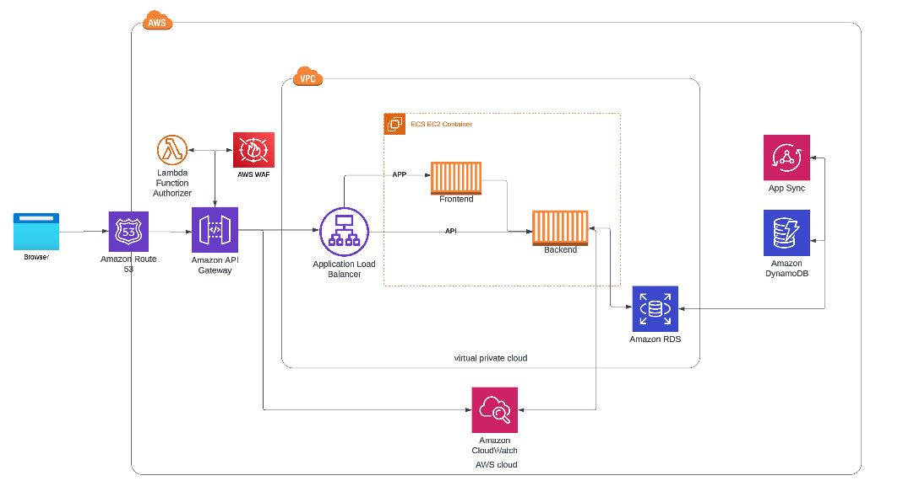

# Week 0 — Billing and Architecture

## Required Homework

### Installed AWS CLI
I was able to get gitpod working via the browser and add the AWS CLI to it on each startup. Really cool tool to add to my arsenal. 

### Created an AWS Budget & Billing Alarm

I chose not to create additional budget and billing alerts via the cli because I had already both some via other instructional videos. Also, I did not want to store personal information within the required json files.

My AWS budget:

My AWS Billing alert:

### Created an Conceptual Diagram with Lucid
https://lucid.app/lucidchart/b167267b-2ba5-477c-9f9d-bcd469d4dd4a/edit?viewport_loc=-1842%2C-857%2C3298%2C1548%2C0_0&invitationId=inv_60216f0d-4acb-4bcb-9451-5e39c397ae78

### Created an Logical Architectural Diagram with Lucid

[Logical Architectual Diagram](https://lucid.app/lucidchart/b167267b-2ba5-477c-9f9d-bcd469d4dd4a/edit?viewport_loc=-76%2C-1030%2C3537%2C1661%2CFTIyns9gMBuk&invitationId=inv_60216f0d-4acb-4bcb-9451-5e39c397ae78)

## Homework Challenges

### Threat Model
This section will contain a threat model for the suggested Architecture and resources this project will leverage

### Security Requirements
This section will contain the security requirements the project will need to meet for resources sand the environment

#### Project 
- Ensure all IAM policies are following the principal of least privilege

##### Resources

###### API Gateway
- Ensure the default API gateway address is disabled
- Ensure a firewall is attached to the gateway to prevent and detect application attacks

###### Application load balancer
- Ensure all traffic is TLS for HTTP communication. If possible, TLS v1.2 should be used across the environment

###### ECS 
- Containers should following the principal of least privilege 
- Containers should not be ran as the root user
- Only ports needed for the functionality of the app should be opened

###### RDS 
- Ensure encryption at rest is enabled 
- Encryption keys are securely stored
- If passwords are used for authentication then ensure the are following best practices in terms of lenght and complexity 
- If IAM is used then ensure that the policy only has the permissions it needs to function

###### DynamoDB
- Ensure encryption at rest is enabled 
- Encryption keys are securely stored

###### Lambda 
- Ensure a secure runtime is selected
- Verify that the lambda is not publicly accessible 

##### Cloudwatch 
- Ensure logs are stored in secure space and encrypted at rest

#### Compliance
Due to the business in which the organization operates they may need to ensure they are GDPR and PCI DSS compliant. Through out the development of the project the organization will need to undergo various rounds of auditing to ensure compliancy. 

### Application & Environment Auditing
As an effort to shift the organization left to identify and fix security concerns earlier rather than later all of engineering will need to implement the following tools:

- Semgrep: Used for detecting security issues in application code
- Checkov: Used for detecting security issues in infrastructure code
- Cloudfox & Prowler: Leveraged for detecting security issues in cloud resources

### References
- https://www.crowdstrike.com/cybersecurity-101/cloud-security/cloud-compliance/
- https://gdpr-info.eu/
- https://listings.pcisecuritystandards.org/documents/PCI_DSS-QRG-v3_2_1.pdf
- https://docs.aws.amazon.com/securityhub/latest/userguide/securityhub-pci-controls.html
- https://docs.aws.amazon.com/amazondynamodb/latest/developerguide/security.html
- https://docs.aws.amazon.com/AmazonECS/latest/bestpracticesguide/security.html
- https://docs.aws.amazon.com/AmazonRDS/latest/UserGuide/UsingWithRDS.html
- https://docs.aws.amazon.com/lambda/latest/dg/lambda-security.html
- https://docs.aws.amazon.com/elasticloadbalancing/latest/userguide/security.html
- https://docs.aws.amazon.com/appsync/latest/devguide/security.html
- https://semgrep.dev/ 
- https://github.com/BishopFox/cloudfox
- https://github.com/prowler-cloud/prowler
- https://www.checkov.io/

