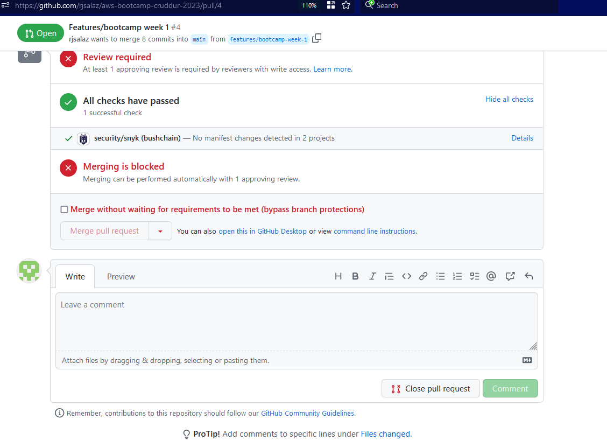
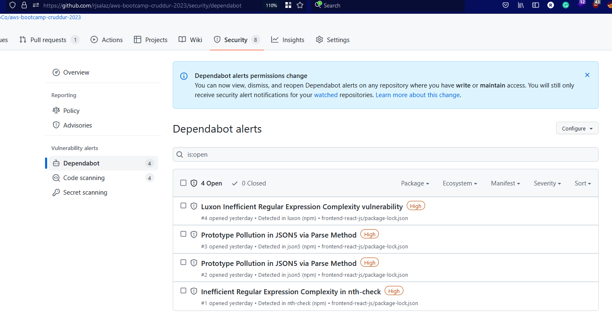

# Week 1 — App Containerization

## Required Homework

### Cloud IDE 
I got much more familiar with using a cloud IDE. Gitpod makes development a lot more simpler since I don't have to install anything locally to my machine

### Docker/Containers 
I have leveraged docker in previous job roles so this weeks class was a great refresher on all the terminology and best practices. I had never used`docker-compose` to centrally  manage the orchestration of multiple containers 

### Programming
I had never used  `flask` or `react` for a project before so getting hands on with these frameworks was awesome.

## Homework Challenges

### Security Recommendations

#### Dependency & Code Analysis
This project leverages multiple 3rd party packages to operate. These 3rd party packages could introduce malicious code that may put the business at risk of various cyber attacks. In order to ensure the business is protected from potential attacks, all engineers must implement 3rd party dependency scanner `Snyk`. Along with `Snyk`, engineers are expected to leverage Github's built in security tools which includes `Dependabot`, `Code scanning`, and `Secret scanning`. Leveraging the above tools will not only assist engineers in identifying malicious code from 3rd parties but will also ensure engineers are following best coding practices in our codebase. 

As of now both `Snyk` and Github's built in security tools are enabled.

Snyk Enabled On Repo

GitHub Security Tools Enabled On Repo

### References
- https://www.synopsys.com/blogs/software-security/open-source-dependency-best-practices/
- https://owasp.org/www-community/controls/Static_Code_Analysis
- https://snyk.io/what-is-snyk/
- https://github.com/features/security