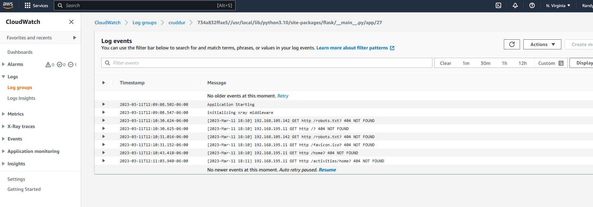
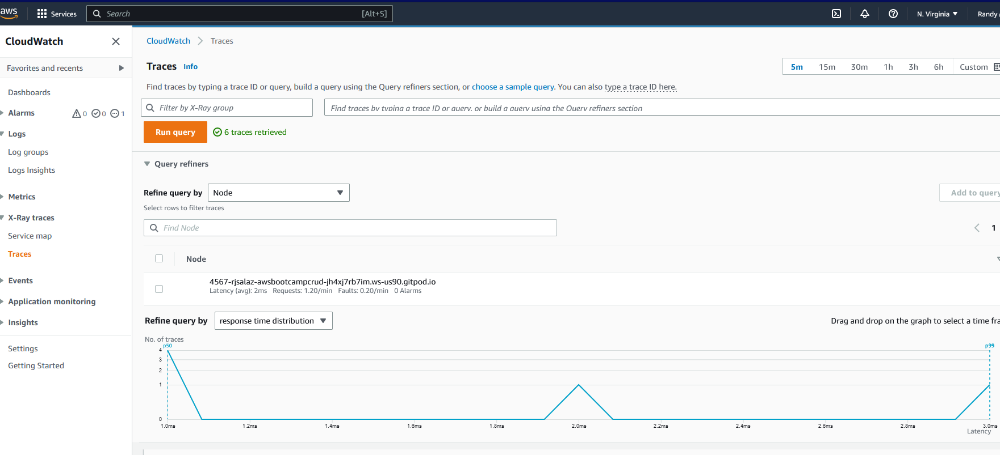
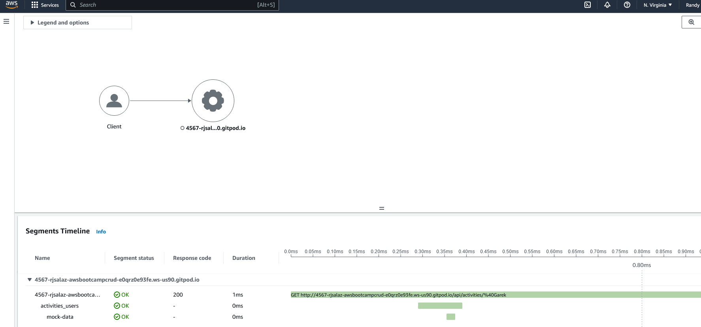
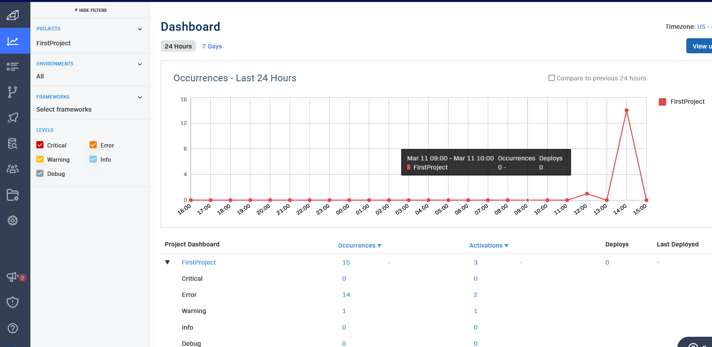
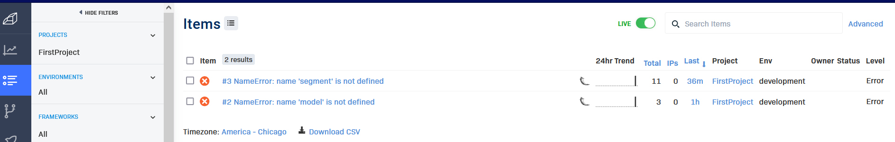

# Week 2 — Distributed Tracing

## Required Homework

### Cloud Watch Logging

This week I was able to get up running with setting up cloudwatch logging in the Crudder application. This was relativity straight forward with the instructions provided. 

The data that is fed into cloudwatch was actually very helpful in terms of understanding what the application was doing while testing. The really cool part is the various other things we can do with this data in AWS. 

### Xray Tracing & Subsegments
X-ray was a confusing tool as it was not clear to set up and integrate with the flask application. In the process of setting it up I realized what a powerful tool to it can be have in terms of the observability it can provide into applications/ 

### Rollbar
Rollbar was super useful in reporting errors that occur in the Crudder application. Being able to sort through logs based on levels  made it super easy identify issues. 

 I was having trouble implementing x-ray subsegments and by just looking at the errors provided by Rollbar I was able to pinpoint issues and get them resolved. Much faster than having to view logs from each container. 

## Homework Challenges

I didn't have much time this week to spend on implementing challenges due to other obligations.